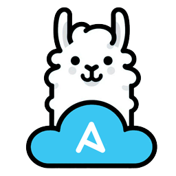
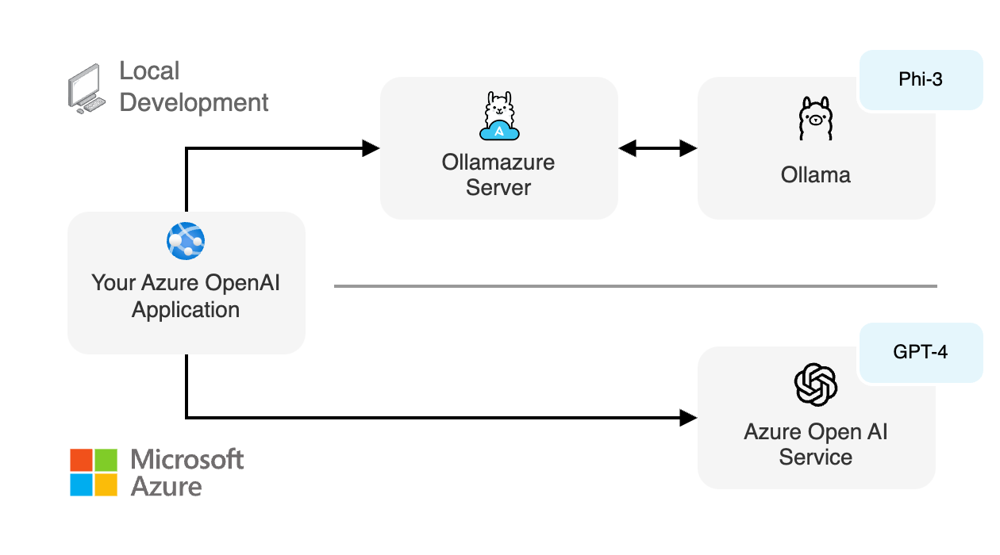

<div align="center">



# ollamazure

[](https://www.npmjs.com/package/ollamazure)
[](https://github.com/sinedied/ollamazure/actions)

[](https://github.com/sindresorhus/xo)
[](https://www.typescriptlang.org)
[](LICENSE)

⭐ If you like this tool, star it on GitHub — it helps a lot!

[Overview](#overview) • [Usage](#usage) • [Azure OpenAI compatibility](#azure-openai-compatibility) • [Sample code](#sample-code)



</div>

Emulates [Azure OpenAI](https://learn.microsoft.com/azure/ai-services/openai/overview) API on your local machine using [Ollama](https://ollama.com) and open-source models.

## Overview

Using this tool, you can run your own local server that emulates the Azure OpenAI API, allowing you to test your code locally without incurring costs or being rate-limited. This is especially useful for development and testing purposes, or when you need to work offline.

By default, [`phi3`](https://ollama.com/library/phi3) is used as the model for completions, and [`all-minilm:l6-v2`](https://ollama.com/library/all-minilm:l6-v2) for embeddings. You can change these models using the [configuration options](#configuration-options).

## Usage

You need [Node.js v20+](https://nodejs.org) and [Ollama](https://ollama.com) installed on your machine to use this tool.

You can either install the CLI globally:

```bash
npm install -g ollamazure
```

Or use it directly with `npx` without installing it:

```bash
npx ollamazure
```

> [!TIP]
> When installed locally, you can run the CLI using either `ollamazure` or `oaz` for short.

### Configuration options

```txt
ollamazure --help
Usage: ollamazure [options]

Emulates Azure OpenAI API on your local machine using Ollama and open-source models.

Options:
  --verbose                  show detailed logs
  -y, --yes                  do not ask for confirmation (default: false)
  -m, --model <name>         model to use for chat and text completions (default: "phi3")
  -e, --embeddings <name>    model to use for embeddings (default: "all-minilm:l6-v2")
  -d, --use-deployment       use deployment name as model name (default: false)
  -h, --host <ip>            host to bind to (default: "localhost")
  -p, --port <number>        port to use (default: 4041)
  -o, --ollama-url <number>  ollama base url (default: "http://localhost:11434")
  -v, --version              show the current version
  --help                     display help for command
```

## Azure OpenAI compatibility

| Feature | Supported / with streaming |
| ------- | -------------------------- |
| [Completions](https://learn.microsoft.com/azure/ai-services/openai/reference#completions) | ✅ / ✅ |
| [Chat completions](https://learn.microsoft.com/azure/ai-services/openai/reference#chat-completions) | ✅ / ✅ |
| [Embeddings](https://learn.microsoft.com/azure/ai-services/openai/reference#embeddings) | ✅ / - |
| [JSON mode](https://learn.microsoft.com/azure/ai-services/openai/how-to/json-mode?tabs=python) | ✅ / ✅ |
| [Function calling](https://learn.microsoft.com/azure/ai-services/openai/how-to/function-calling) | ⛔ / ⛔ |
| [Reproducible outputs](https://learn.microsoft.com/azure/ai-services/openai/how-to/reproducible-output?tabs=pyton) | ✅ / ✅ |
| [Vision](https://learn.microsoft.com/azure/ai-services/openai/how-to/gpt-with-vision?tabs=rest%2Csystem-assigned%2Cresource) | ⛔ / ⛔ |
| [Assistants](https://learn.microsoft.com/azure/ai-services/openai/how-to/assistant) | ⛔ / ⛔ |

Unimplemented features are currently not supported by Ollama, but are being worked on and may be added in the future.

## Sample code

See all code examples in the [samples](samples) folder.

### Azure OpenAI SDK

```typescript
import { AzureOpenAI } from 'openai';

const openai = new AzureOpenAI({
  // This is where you point to your local server
  endpoint: 'http://localhost:4041',

  // Parameters below must be provided but are not used by the local server
  apiKey: '123456',
  apiVersion: '2024-02-01',
  deployment: 'gpt-4',
});

const chatCompletion = await openai.chat.completions.create({
  messages: [{ role: 'user', content: 'Say hello!' }],
});

console.log('Chat completion: ' + chatCompletion.choices[0]!.message?.content);
```

> [!TIP]
> Alternatively, you can set the `AZURE_OPENAI_ENDPOINT` environment variable to `http://localhost:4041` instead of passing it to the constructor. Everything else will work the same.

If you're using managed identity, this will work as well unless you're in a local container. In that case, you can use a dummy function `() => '1'` for the the `azureADTokenProvider` parameter in the constructor.

### LangChain.js

```typescript
import { AzureChatOpenAI } from '@langchain/openai';

// Chat completion
const model = new AzureChatOpenAI({
  // This is where you point to your local server
  azureOpenAIBasePath: 'http://localhost:4041/openai/deployments',

  // Parameters below must be provided but are not used by the local server
  azureOpenAIApiKey: '123456',
  azureOpenAIApiVersion: '2024-02-01',
  azureOpenAIApiDeploymentName: 'gpt-4'
});

const completion = await model.invoke([{ type: 'human', content: 'Say hello!' }]);
console.log(completion.content);
```

> [!TIP]
> Alternatively, you can set the `AZURE_OPENAI_BASE_PATH` environment variable to `http://localhost:4041/openai/deployments` instead of passing it to the constructor. Everything else will work the same.

If you're using managed identity this will work the same unless you're in a local container. In that case, you can use a dummy function `() => '1'` for the the `azureADTokenProvider` parameter in the constructor.

### LlamaIndex.TS

```typescript
import { OpenAI, OpenAIEmbedding } from "llamaindex";

// Chat completion
const llm = new OpenAI({
  azure: {
    // This is where you point to your local server
    endpoint: 'http://localhost:4041',

    // Parameters below must be provided but are not used by the local server
    apiKey: '123456',
    apiVersion: '2024-02-01',
    deployment: 'gpt-4'
  }
});

const chatCompletion = await llm.chat({
  messages: [{ role: 'user', content: 'Say hello!' }]
});

console.log(chatCompletion.message.content);
```

> [!TIP]
> Alternatively, you can set the `AZURE_OPENAI_ENDPOINT` environment variable to `http://localhost:4041` instead of passing it to the constructor. Everything else will work the same.

If you're using managed identity, this will work as well unless you're in a local container. In that case, you can use a dummy function `() => '1'` for the the `azureADTokenProvider` parameter in the constructor.
